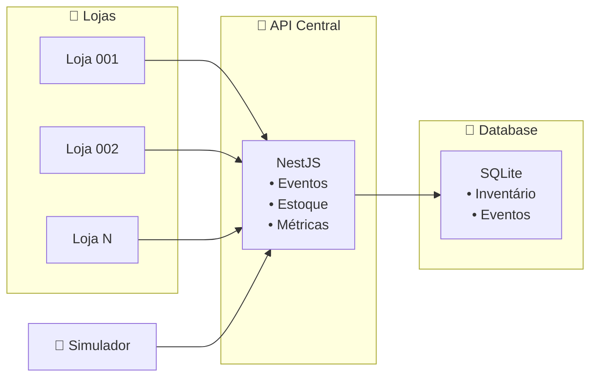

# Arquitetura do Sistema

## Diagrama Simplificado

## Fluxo Básico

1. **Lojas** enviam eventos de estoque
2. **API** processa com idempotência e versão
3. **Database** armazena inventário e eventos
4. **Simulador** gera eventos de teste

## Tecnologias

- **Backend**: NestJS + Prisma + SQLite
- **Observabilidade**: Prometheus + Health Check
- **Testes**: Simulador Node.js 