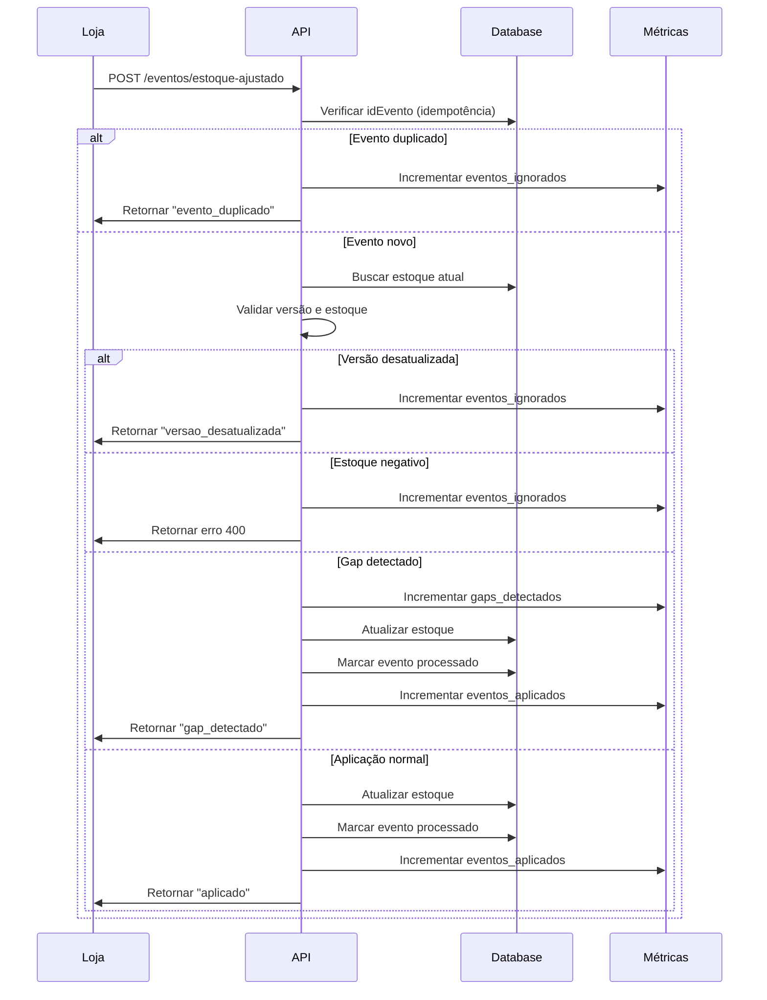

# Arquitetura do Sistema de Inventário Distribuído

## Visão Geral

Sistema centralizado para gestão de inventário com controle de versão, idempotência e observabilidade.

## Diagrama Arquitetural

```mermaid
graph TB
    subgraph "🏪 Lojas Distribuídas"
        L1[Loja 001<br/>• POS<br/>• Sistema]
        L2[Loja 002<br/>• POS<br/>• Sistema]
        L3[Loja N<br/>• POS<br/>• Sistema]
    end

    subgraph "🏢 API Central (NestJS)"
        ES[EventosService<br/>• Idempotência<br/>• Controle Versão<br/>• Validação<br/>• Gap Detection]
        OS[Observabilidade<br/>• Health Check<br/>• Métricas Prometheus<br/>• Logs]
    end

    subgraph "💾 SQLite Database"
        IP[InventarioPorLoja<br/>• idLoja, sku (PK)<br/>• quantidade<br/>• versao<br/>• atualizadoEm]
        EP[EventoProcessado<br/>• idEvento (PK)<br/>• criadoEm]
    end

    subgraph "🔄 Simulador (Node.js)"
        S[Simulador<br/>• 100 eventos<br/>• 70% vendas (-1)<br/>• 30% reposições (+5)<br/>• 10% gaps]
    end

    L1 -->|HTTP Events| ES
    L2 -->|HTTP Events| ES
    L3 -->|HTTP Events| ES
    S -->|HTTP Events| ES
    
    ES -->|Prisma ORM| IP
    ES -->|Prisma ORM| EP
    ES --> OS

    style L1 fill:#e1f5fe
    style L2 fill:#e1f5fe
    style L3 fill:#e1f5fe
    style ES fill:#c8e6c9
    style OS fill:#fff3e0
    style IP fill:#f3e5f5
    style EP fill:#f3e5f5
    style S fill:#ffebee
```

## Fluxo de Eventos



## Componentes Principais

### 🏪 Lojas Distribuídas
- **Responsabilidade**: Gerar eventos de ajuste de estoque
- **Tecnologia**: Sistemas POS locais
- **Comunicação**: HTTP REST para API central

### 🏢 API Central (NestJS)
- **EventosService**: Processamento de eventos com idempotência
- **EstoqueService**: Consultas de inventário
- **MetricasService**: Observabilidade com Prometheus
- **HealthController**: Verificação de saúde do sistema

### 💾 Database (SQLite)
- **InventarioPorLoja**: Estoque por loja e produto
- **EventoProcessado**: Controle de idempotência

### 🔄 Simulador
- **Responsabilidade**: Gerar eventos de teste
- **Estratégia**: Vendas, reposições e gaps de versão

## Decisões Arquiteturais

### Consistência vs Disponibilidade
- **Escolha**: Consistência (CP do CAP)
- **Justificativa**: Inventário precisa ser preciso

### Idempotência
- **Implementação**: Tabela EventoProcessado
- **Benefício**: Evita processamento duplicado

### Controle de Versão
- **Implementação**: Campo versao por (loja, produto)
- **Benefício**: Garante ordem dos eventos

### Observabilidade
- **Métricas**: Prometheus para monitoramento
- **Health Check**: Verificação de saúde
- **Logs**: Estruturados para debugging 