# Arquitetura do Sistema

## Diagrama Simplificado

```mermaid
graph LR
    subgraph "🏪 Lojas"
        L1[Loja 001]
        L2[Loja 002]
        L3[Loja N]
    end

    subgraph "🏢 API Central"
        API[NestJS<br/>• Eventos<br/>• Estoque<br/>• Métricas]
    end

    subgraph "💾 Database"
        DB[SQLite<br/>• Inventário<br/>• Eventos]
    end

    L1 --> API
    L2 --> API
    L3 --> API
    API --> DB

    S[🔄 Simulador] --> API
```

## Fluxo Básico

1. **Lojas** enviam eventos de estoque
2. **API** processa com idempotência e versão
3. **Database** armazena inventário e eventos
4. **Simulador** gera eventos de teste

## Tecnologias

- **Backend**: NestJS + Prisma + SQLite
- **Observabilidade**: Prometheus + Health Check
- **Testes**: Simulador Node.js 